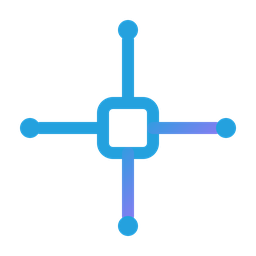

# Traefik Manager for umbrelOS

A community app store for [umbrelOS](https://umbrel.com) with two apps:

| App | What it installs | Use it when |
|---|---|---|
| **Traefik Manager** | [Traefik Manager](https://github.com/chr0nzz/traefik-manager) and its own Traefik | You want the whole thing on your Umbrel |
| **Traefik Manager Agent** | The Traefik Manager agent and its own Traefik | You already run Traefik Manager on another machine and want it to manage a Traefik on your Umbrel. Needs umbrelOS 2.0 or later |

> [!WARNING]
> **Both apps need setup outside umbrelOS.** umbrelOS keeps ports 80 and 443 for itself, so the Traefik in these apps listens on other ports, and nothing outside your network reaches it until you forward ports on your router. Read [Required setup](#required-setup) before you install.

## Add the app store

1. In umbrelOS, open the **App Store**.
2. Open the menu in the top right corner and choose **Community App Stores**.
3. Paste `https://github.com/chr0nzz/tm-UmbrelOS` and click **Add**.
4. Open **Traefik Manager App Store** and install the app you want.

## Required setup

### 1. Forward ports on your router

| App | Forward external port 80 to | Forward external port 443 to |
|---|---|---|
| Traefik Manager | `42080` on your Umbrel | `42443` on your Umbrel |
| Traefik Manager Agent | `43080` on your Umbrel | `43443` on your Umbrel |

The two apps use different ports, so they can be installed side by side.

### 2. Point your DNS at your public IP

Create `A` (and `AAAA` if you use IPv6) records for each domain you want to serve, pointing at your public IP address.

### 3. Certificates

Traefik gets certificates from Let's Encrypt with the HTTP challenge, using the certificate resolver `letsencrypt`. The challenge arrives on port 80, so it only works once port 80 is forwarded as above. New routes use this resolver by default.

### 4. Route to your other Umbrel apps

Route to an app's **container**, not to `umbrel.local`. Going through `umbrel.local` sends the request through that app's Umbrel login page.

Find the container and port in the app's `docker-compose.yml` in the [official Umbrel app repository](https://github.com/getumbrel/umbrel-apps), under `app_proxy`: they are `APP_HOST` and `APP_PORT`.

| App | Backend URL |
|---|---|
| Immich | `http://immich_server_1:2283` |
| Jellyfin | `http://jellyfin_server_1:8096` |
| Nextcloud | `http://nextcloud_web_1:80` |
| Vaultwarden | `http://vaultwarden_server_1:8089` |

Apps that use host networking, such as Home Assistant and Plex, have no container to route to. Reach them through the host instead:

| App | Backend URL |
|---|---|
| Home Assistant | `http://host.docker.internal:8123` |
| Plex | `http://host.docker.internal:32400` |

If a `host.docker.internal` route times out, a firewall on your Umbrel is blocking containers from reaching the host. umbrelOS does not run one by default.

> [!IMPORTANT]
> A route you publish through this Traefik is **not** behind the Umbrel login. Protect anything sensitive with the app's own login or with an authentication middleware in Traefik Manager.

## Traefik Manager app

- The first time you open it, the setup wizard asks you to create a Traefik Manager login. The Umbrel login is switched off for this app so that the Traefik Manager login, API keys and the [mobile app](https://play.google.com/store/apps/details?id=dev.chr0nzz.traefikmanager) all work.
- Changes to the static config restart Traefik on their own, without Docker socket access.
- Your data lives in `~/umbrel/app-data/tm-traefik-manager/data/` by default, unless you move the app's storage in umbrelOS 2.0. App updates never overwrite it.

| Path | Holds |
|---|---|
| `traefik/static/traefik.yml` | Traefik's static config, editable in Traefik Manager |
| `traefik/dynamic/` | Your routes, middlewares and services |
| `traefik/acme/` | Certificates |
| `tm/config/` | Traefik Manager's settings and login |
| `tm/backups/` | Backups taken before every change |

## Traefik Manager Agent app

1. Install the app. It keeps restarting until the next step is done. That is expected.
2. In your Traefik Manager, open **Settings**, **Agents**, add an agent and copy the API key it shows.
3. In umbrelOS, open this app's settings and paste the key into **TMA_API_KEY**. The agent starts.
4. In Traefik Manager, use `http://umbrel.local:4490` as the agent's URL, or your Umbrel's IP address with port `4490`.

The agent has no web interface of its own. Opening it from the Umbrel dashboard only shows its health status.

## How this fits with umbrelOS

This Traefik runs next to the reverse proxy built into umbrelOS and does not replace it. umbrelOS keeps serving its dashboard and your apps on ports 80 and 443 as before. Traefik only answers on its own ports, for the domains you route through it.

## Limitations

- The **Docker** provider is not available, because the apps do not mount the Docker socket. Routes are managed through Traefik's file provider, which is what Traefik Manager edits.
- These apps are in this community store, not the official Umbrel App Store.

Problems or questions: open an issue on the [Traefik Manager tracker](https://github.com/chr0nzz/traefik-manager/issues) and mention umbrelOS in the title, or ask on the [Discord](https://discord.gg/vRQCMrrjtz).

## Versions

Both apps use the `latest` Traefik Manager, agent and Traefik images. umbrelOS pulls images when an app is installed or updated, so an install picks up the newest release at that time. A workflow checks for a new Traefik Manager release every six hours and bumps both apps, so installed apps get an update in the umbrelOS App Store.

## License

GPL-3.0, see [LICENSE](LICENSE).
